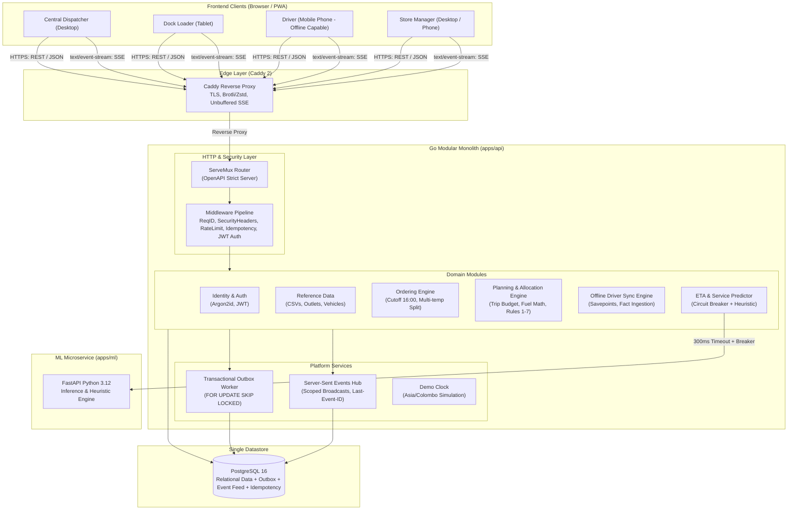
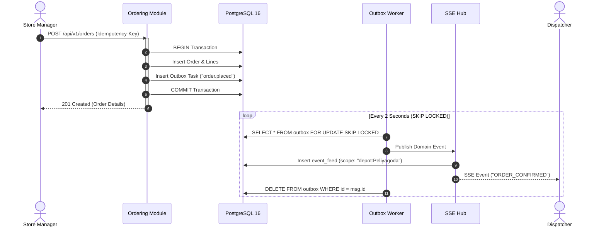
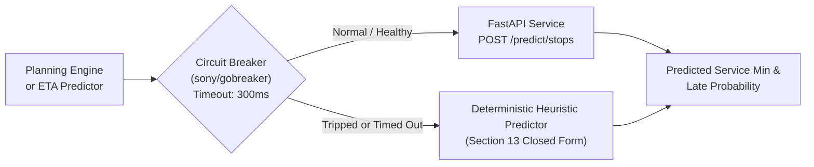

# Waypoint Delivery Platform: Architecture

This document describes the high-level architecture, module boundaries, data flow, and failure recovery modes of the Waypoint Delivery Platform.

---

## 1. System Architecture Diagram

---

## 2. In-Process Domain Events & Outbox Pattern (ADR-004)

---

## 3. Resilient ML Service Integration (ADR-004)

---

## 4. Offline Driver Fact Sync & Conflict Resolution (ADR-006)

1. **Client Source of Truth for What Happened**: Driver mobile app logs events locally with client-generated UUIDv7 identifiers and monotonically increasing device sequence numbers.
2. **Atomic Batch Ingestion**: Drivers submit batched events to `POST /api/v1/sync/push`.
3. **Transaction Savepoints**: Each event in the batch executes inside a PostgreSQL `SAVEPOINT`. If an individual event is invalid, only that savepoint is rolled back; valid events are safely committed.
4. **Optimistic Version Verification**: If an event operates against an older plan version, the server accepts the fact, recalculates downstream delays, updates ETAs, and returns `conflict: true` with the latest entities so the client reconciles immediately.
5. **Real-Time Dispatcher Notification**: Stop arrival and delivery events automatically trigger SSE updates on the `depot:<Depot>` scope so dispatchers see live progress without manual refreshing.
