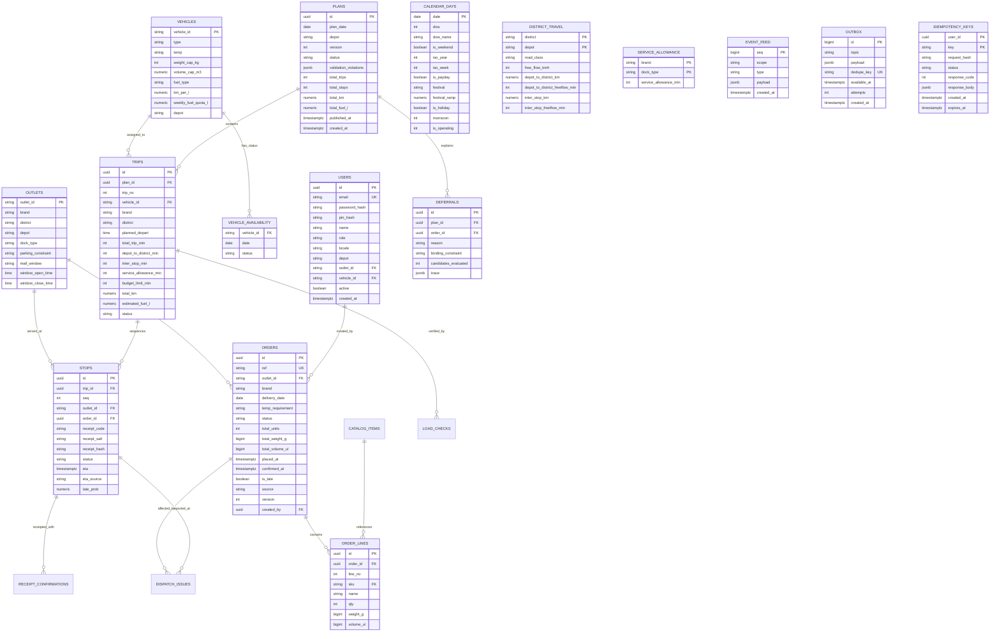

# Waypoint Delivery Platform: Data Model & Schema (ERD)

This document provides the authoritative schema documentation and Entity-Relationship Diagram (ERD) for the Waypoint Delivery Platform modular monolith datastore (PostgreSQL 16).

---

## 1. Physical Units & Precision Standard (ADR-008)

All physical capacities and measurements use integer arithmetic or exact `NUMERIC` types to avoid float comparison issues:
- **Mass / Weight**: Integer grams (`total_weight_g`, `weight_cap_kg * 1000`)
- **Volume**: Millilitres-of-m³ / microlitres (`volume_ul` where $1\text{ m}^3 = 1,000,000,000\text{ }\mu\text{L}$, or `volume_mm3` where $1\text{ m}^3 = 1,000,000\text{ mL}$)
- **Fuel**: Millilitres of fuel ($1\text{ L} = 1,000\text{ mL}$)
- **Timestamps**: UTC `timestamptz` with application timezone `Asia/Colombo` (+05:30)

---

## 2. Mermaid Entity-Relationship Diagram (ERD)

---

## 3. Core Database Tables & Indexes

### 3.1 Ordering & Cutoff
- `orders`: Indexed on `(outlet_id, delivery_date)`, `(status, delivery_date)`, `delivery_date`, and unique `ref`.
- Optimistic locking using integer `version` incremented on every status update.
- Fresh split baskets maintain linked provenance while ambient and chilled items travel on separate multi-compartment or dedicated reefer vehicles.

### 3.2 Planning & Execution
- `plans`: Indexed on `(depot, plan_date, version DESC)`.
- `trips`: Indexed on `(plan_id, trip_no)`, `vehicle_id`.
- `stops`: Indexed on `(trip_id, seq)`, `order_id`, `outlet_id`.

### 3.3 Offline Sync & Events
- `device_events`: Client-generated `uuid` as primary key ensures guaranteed server idempotency.
- `event_feed`: Monotonically increasing `BIGSERIAL` sequence (`seq`) driving resumable Server-Sent Events with `Last-Event-ID`.
- `outbox`: High-throughput transactional worker queue utilizing `FOR UPDATE SKIP LOCKED`.
- `idempotency_keys`: Scoped by authenticated `user_id` and SHA-256 request payload hash.
